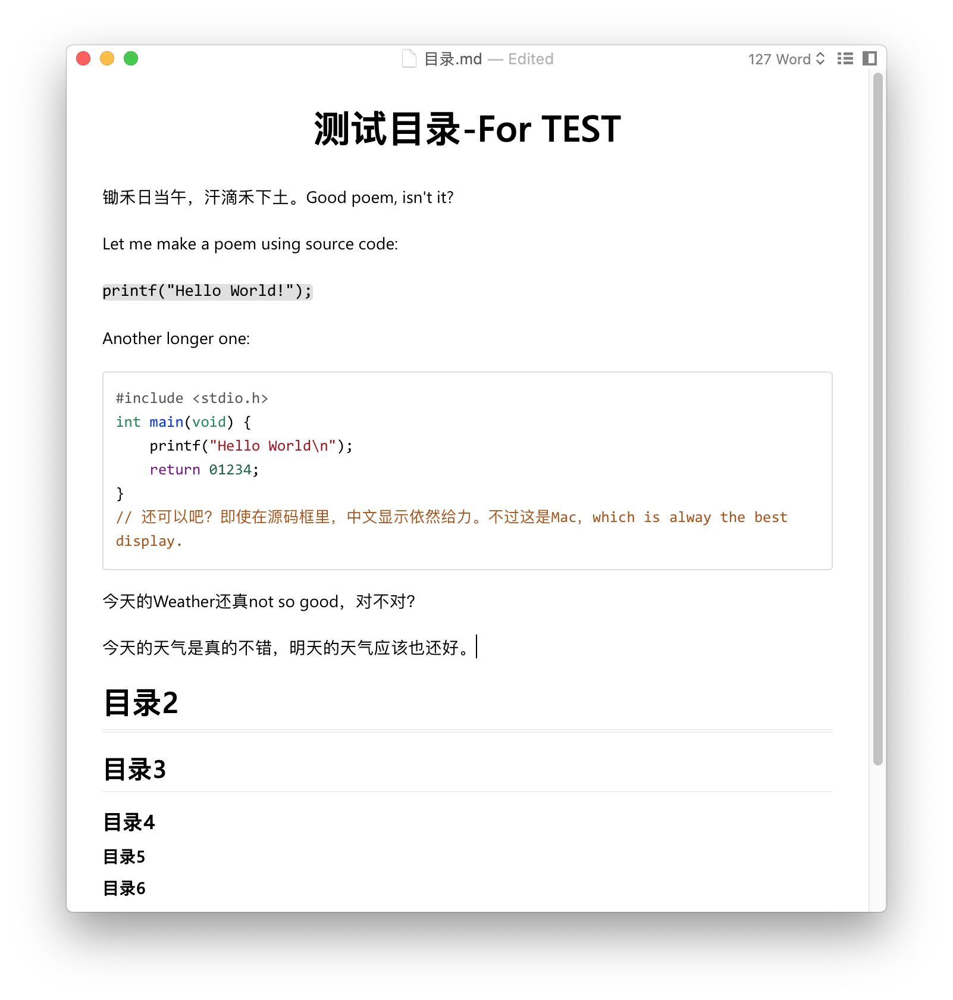

# hanCode

## Introduction

`hanCode` is a typro theme base on [techo](https://github.com/lfkdsk/techo.css):

> Techo.css was created to help in creation of Chinese articles, or other like Japanese articles. In Chinese and Japanese, techo (手帳 てちょう) means a notebook to record life things.

`techo` has a very good display effect for Chinese or Japanese character. To make alphabet and source code display at the same level, `hanCode` made some specific modifications. `hanCode` has below features:

* Most harmonious display for Hanzi, alphabet and source code mixture.
* A clean color scheme for programer.
* Distinct heads: H1 lies in center, H2 and H3 has different bottom border and H4, H5 has no border. 

## Usage

Directly copy `hancode.css` to `typro` theme directory, then restart `typro`, then select `hancode` from `Themes` menu.
